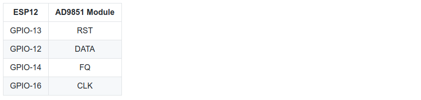
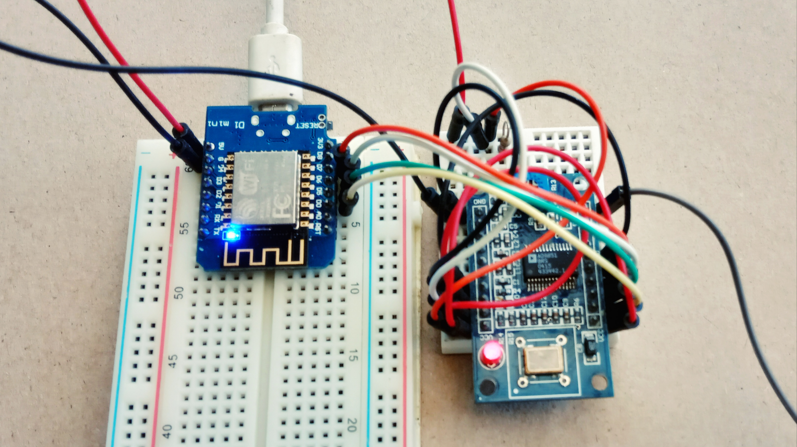

# ESP12 & AD9851 DDS RF Jammer Controlled via MQTT Protocol
This project demonstrate a rather simple implementation of ESP-12 & AD9851 DDS as an RF Jammer (random frequency hopping) which can be controlled via MQTT protocol over the internet.
The parameters which we can control:
* RF Jamming action (enable/disable)
* Starting Frequency (minimum freq.)
* Stop Frequency (maximum freq.)

And then the device then reports back these parameters.

Tested on Wemos D1 mini and cheap AD9851 DDS module with **30MHz external clock**.
Compiled using Arduino IDE 1.8.9.

## Dependencies
There are a few dependencies required:
* [ESP8266 Core for Arduino](https://github.com/esp8266/Arduino). Please follow the installation instruction.
* [PubSubClient](https://github.com/knolleary/pubsubclient) library. Personally, I am using [this](https://github.com/knolleary/pubsubclient) library.
* My [AD9851 DDS](https://github.com/handiko/AD9851) library. Please follow the installation [instruction](https://github.com/handiko/AD9851#instalation).

## ESP12 to AD9851 DDS Module Connections


**Very important:**
* AD9851 DDS Module must be using **30MHz external oscillator**.
* **Don't forget** to pull up the DDS D0 and D1 pins to 5V thru a 10k resistor and ground the DDS D2 pin. Otherwise, the serial programming wouldn't work (please refer to the datasheet, page 15, figure 18).
* Tips: put some length of wire to the RF output pin of the AD9851 DDS module for which acts as an rudimentary antenna. It will boost the signal greatly.



## Usage
* Please use your own **username, password, and mqtt broker service**, then put into:
```cpp
const char* brokerUser = "my_broker_username";
const char* brokerPass = "my_broker_password";
const char* broker = "my_broker_server";
```
personally, i am using `mqtt.dioty.co` for the broker server, therefore my username would be `myemail@email.com`. You can use another mqtt broker server.

* Put your **WiFi credentials** into:
```cpp
wifiMulti.addAP("ssid_from_AP_1", "your_password_for_AP_1");
wifiMulti.addAP("ssid_from_AP_2", "your_password_for_AP_2");
wifiMulti.addAP("ssid_from_AP_3", "your_password_for_AP_3");
```
you can whether use only one SSID and password or all of them.

* You can use the initial default `min_freq` and `max_freq` as is, or use another frequency accordingly. Please note that absolute maximum fundamental frequency which AD9851 can generate properly is < 90 MHz (30 MHz external osc. with 6x multiplier).
* RF Jammer status, `min_freq`, and `max_freq` is reported into the `/out/stat`, `/out/minFreq`, and `/out/maxFreq` topic respectively.
* RF Jammer enabling/disabling commands, and new values for the `min_freq` and `max_freq` are received from the `/in/en`, `/in/minFreq`, and `/in/maxFreq` topic respectively.

## In Action
* For monitoring the signal, I'm using RTL-SDR dongle and GQRX SDR Software.
* My initial `min_freq` and `max_freq` are 34.8 MHz and 35.2 MHz, therefore I tuned my RTL-SDR to 35 MHz of center frequency.
* After the ESP12 connected to the local WiFi, it will starts to transmit a bunch of RF signals which you can monitor.
* For controlling the RF Jammer, I'm using MQTT Dashboard smartphone app with proper settings. If I were to change the frequencies or disable/re-enable the jammer, the device would response accordingly.

## TODO
* Optimize the code (there is a lot of room for improvements!!)
* Adding capabitilies for controlling another I/O ports.
* ...

## Contributing
1. Fork it [https://github.com/handiko/ESP12-MQTT-RF-Jammer/fork](https://github.com/handiko/ESP12-MQTT-RF-Jammer/fork)
2. Create new branch (`git checkout -b myfeature`)
3. Do some editing / create new feature
4. Commit your works (`git commit -m "Adding some feature blah blah blah.."`)
5. Push to the branch (`git push -u origin myfeature`)
6. Create a new Pull Request
